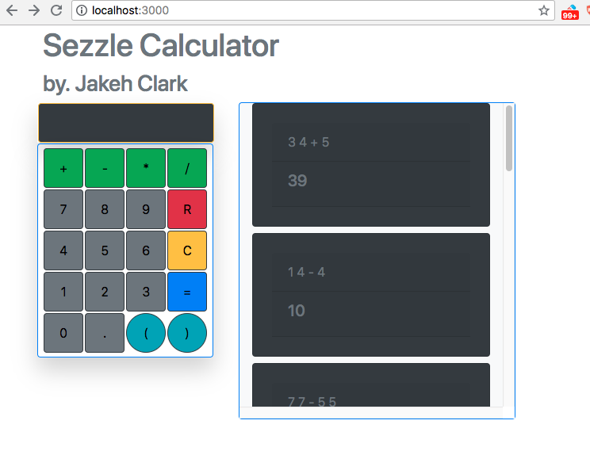

# Sezzle Calculator
This is a full-stack calculator.

## Built With
* React
* Node.js
* Express
* MongoDB
* Mongoose
* Math.js
* Axios
* SweetAlert
* Nodemon

##Checkpoints:

1. [x] Create Boilerplate & Initialize File
2. [x] Create starter DOM elements (Components)
	* Buttons
		* [x] Number
		* [x] Operator
		* [x] Clear
		* [x] Reset
	* [x] Display for Input
3. [x] Store userinput in state called UserInputArray
	* [x] Use a logic module 
	* [x] Display current userInputArray on dom
	* [x] Concatenate this array together to generate expression.
	* [x] Display results on a table (for testing)
		* [x] History fills from top to bottom
4. [x] Add functionality to Clear button
	* Clear should erase the input field
5. [x] Add functionality to Reset button
	* Reset should delete all history
6. [x] Create server-side functionality for buttons, with axios requests
7. [x] Create validator to prevent faulty entries from appearing in history 
8. [x] Add functionality for live history updates
	* Use an interval timer to refresh component

## Screenshot

## Next Steps
* Add socket.io for better live updates.

## Author
Jakeh Clark